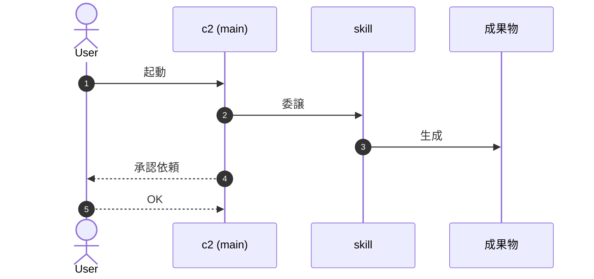
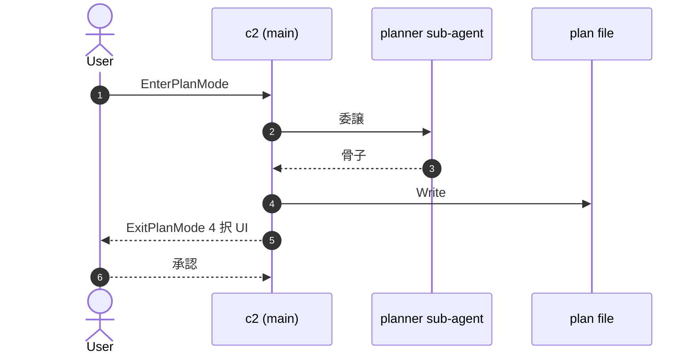
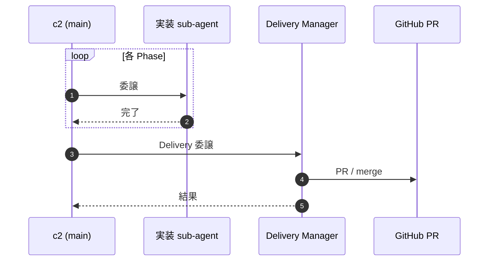
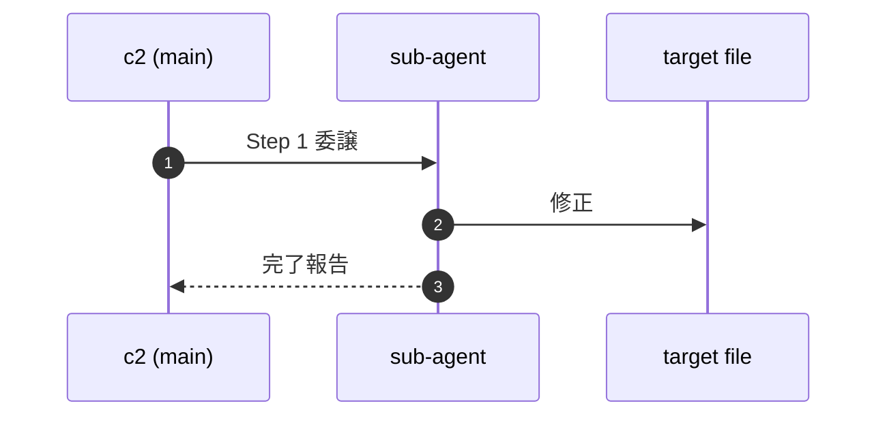

## 1. Context

## 2. Glossary

- **term 1** — 定義 1
- **term 2** — 定義 2
- **term 3** — 定義 3
- **term 4** — 定義 4
- **term 5** — 定義 5

## 3. Goal

## 4. Goal 達成後の全体像 (Big Picture)

### 4.1 Flow A: action 名 (例: Spec 作成)



### 4.2 Flow B: action 名 (例: Plan 作成)



### 4.3 Flow C: action 名 (例: 実装 〜 Delivery)



### 4.X 規律の責務分担

- **User**:
- **c2 main**:
- **sub-agent 群**:
- **Hook 群**:

## 5. Non-Goal

-

## 6. Acceptance Scenarios (Gherkin)

### 6.1 Scenario A1: 名前

```gherkin
Scenario A1:
  Given 前提
  When  action
  Then  outcome
```

### 6.2 Scenario A2: 名前

```gherkin
Scenario A2:
  Given
  When
  Then
```

## 7. Devil's Advocate

### 7.1 前提は正しいか

**観点別展開: 必要** (security / ops / ceo で前提が異なる)

- **前提**: ユーザー要求の暗黙の仮定を 1 文で書く
- **未検証ポイント**: 主観/一般論で済ませている点
- **検証方法**: Phase 後 N 期間で測る KPI / 観察方法
- **NG 時の判断**: 撤去 / 縮小 / ピボット の閾値

### 7.2 もっと簡単な代替案はあるか

**観点別展開: 統合 OK** (1 sub-section に複数観点をまとめて記載可)

1. **do-nothing**: 何もしない場合の現状コスト
2. **代替案 A**: 短所/長所 を 1 文ずつ
3. **代替案 B**: 短所/長所
4. **採用案 vs 代替の差分**: なぜ採用案が勝つか

### 7.3 見落としているリスク・副作用

**観点別展開: 必要** (CRITICAL/HIGH/MED/LOW で観点別に列挙)

1. **後続セッションへの影響**: 1 行
2. **依存破壊の可能性**: 1 行
3. **規律違反のリスク**: 1 行 (Backlog Discipline / Stop Whitelist 等との矛盾)
4. **パフォーマンス/コスト影響**: 1 行

### 7.4 ユーザー価値 (PM 視点)

**観点別展開: 必要** (PdM / CEO / DX / Ops で価値の質が異なる)

- **動く**: 機能として動作するか
- **使える**: 実運用で使えるか (UX / 学習コスト)
- **使い続けられる**: 継続コスト / 飽き / メンテナンス負荷
- **真の価値貢献**: success criteria / KPI に直接寄与するか

### 7.5 テスト戦略

**観点別展開: 統合 OK**

- **Unit**: 何を vitest/jest でカバーするか / N/A
- **Integration**: API 境界の検証 / N/A
- **E2E / on-device**: critical path の確認
- **Manual sanity (non-blocking)**: 人手で確認する事項

### 7.6 既存実装の削除候補はあるか (zero-base review)

**観点別展開: 統合 OK** (1 箇所に列挙)

- **削除候補**: 削除可能な既存実装 / 「N/A — 該当なし」も明示
- **シンプル化候補**: 既存を簡素化できる箇所
- **削除+追加の組合せ**: 削除と追加をセットで行う案
- **判断根拠**: KISS / 重複排除 / 凝集度 のどれを優先するか

## 8. Design

### 8.1 Phase 1: Phase 名



### 8.2 Phase 2: Phase 名


### 8.X 設計判断の補足

-

## 9. Risks & Mitigations

### 9.1 [HIGH] Risk title (Step N)

- **発生条件**:
- **対策**:
- **検証**:
- **ロールバック**:

### 9.2 [MED] Risk title

- **発生条件**:
- **対策**:
- **検証**:
- **ロールバック**:

## 10. Out of Scope

-

## 11. 関連 Plan の Notion URL

-

## 12. Backlog 候補

| title | description (why + how to resume) | project-slug | defer-period |
|---|---|---|---|
| (placeholder) | (placeholder) | _claude-meta | next-session |

## 13. Rule Reduction Candidates

| 削減候補 | 理由 (なぜ不要か) | 削減後の代替 (どう担保するか) |
|---|---|---|
| (placeholder) | (placeholder) | (placeholder) |
